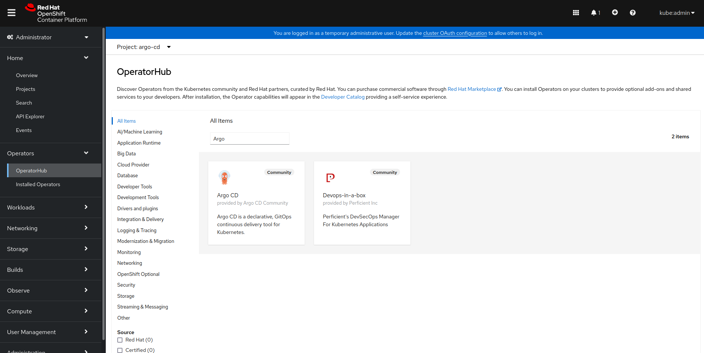
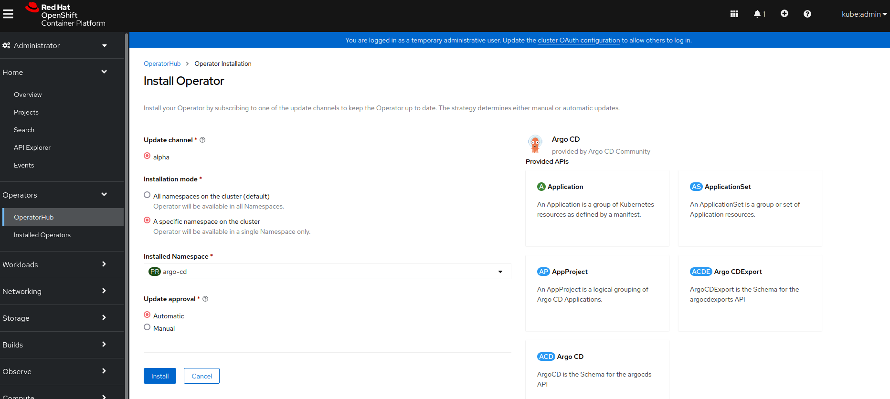
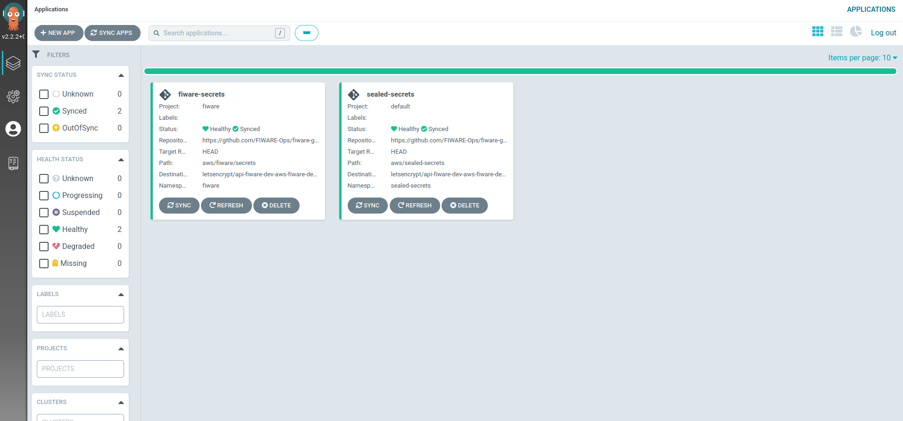
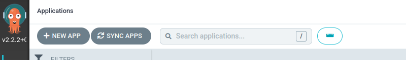
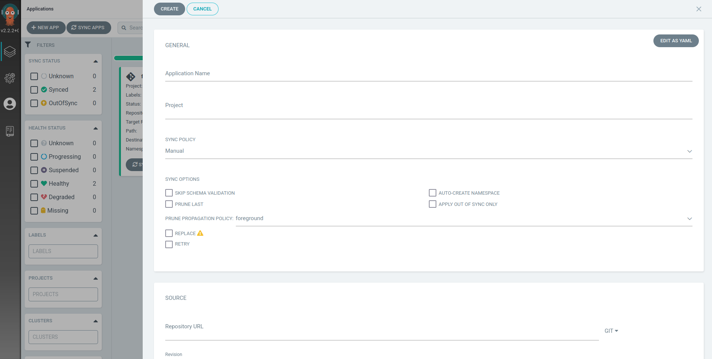
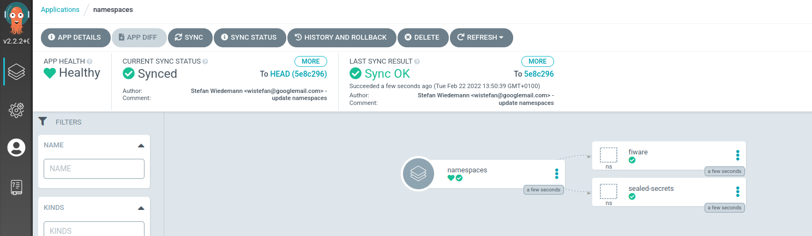
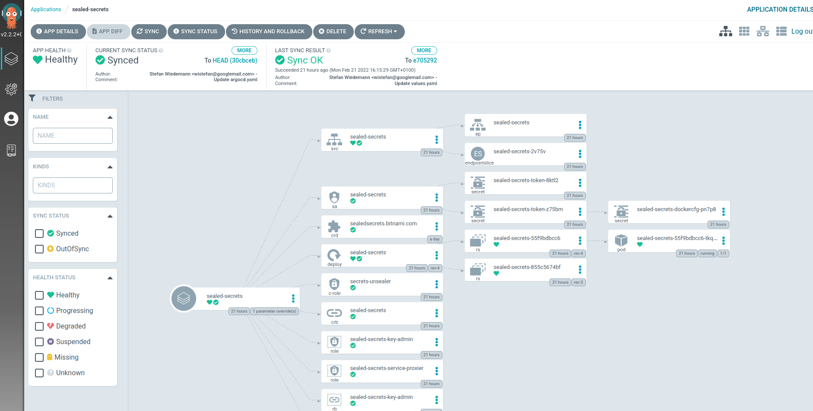
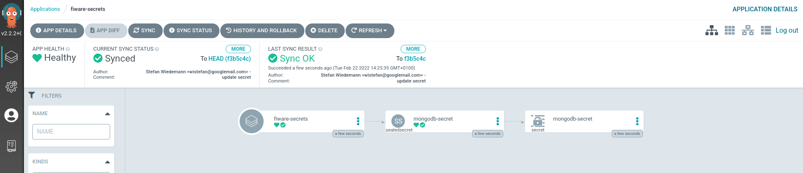
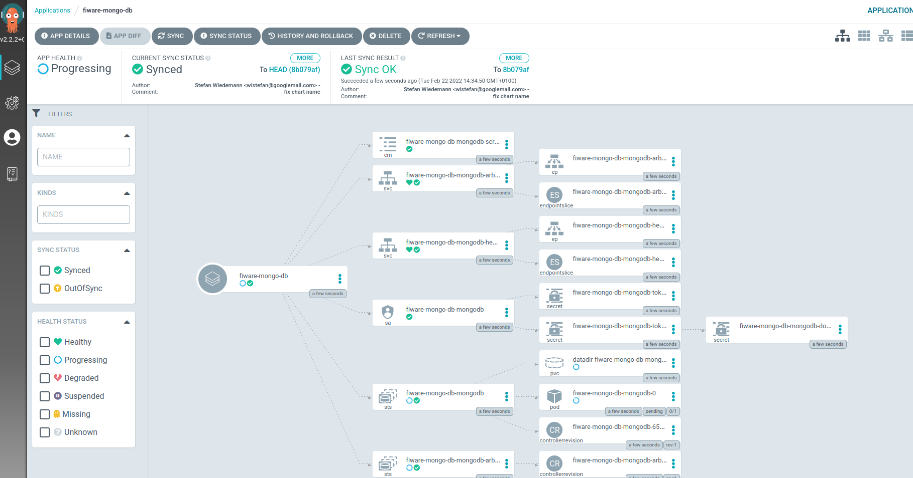

# Resource definitions for FIWARE-k8s clusters

This repository contains resource definitions for running FIWARE's Kubernetes clusters on [AWS EC2 Instances](https://aws.amazon.com/ec2/), using [RedHat OpenShift](https://cloud.redhat.com/learn/what-is-openshift).
The repository follows the [GitOps pattern](https://www.gitops.tech/), implemented by [ArgoCD](https://argo-cd.readthedocs.io/en/stable/). 

More information about GitOps:
- RedHat Pros and Cons - https://www.redhat.com/architect/gitops-implementation-patterns
- ArgoCD - https://argo-cd.readthedocs.io/en/stable/
- FluxCD - https://fluxcd.io/

## How to setup

When following all described steps, the resulting cluster will be a fully working copy of the Kubernetes Clusters, operated by the [FIWARE Foundation e.V.](https://www.fiware.org).
If a cluster is already available, you can skip the steps that are already fulfilled. Be aware that this might require changes to the following steps, depending on the degree of deviation from the proposed setup.

1. [Prepare AWS account](#1-prepare-aws-account)
2. [Install OpenShift cluster](#2-install-openshift-cluster)
3. [Install certificates](#3-install-certificates)
4. [Install ArgoCD](#4-install-argocd)
5. [Prepare ArgoCD for namespaced deployments](#5-prepare-argocd-for-namespaced-deployments)
6. [Deploy namespaces](#6-deploy-namespaces)
7. [Deploy bitnami/sealed-secrets](#7-deploy-bitnamisealed-secretshttpsgithubcombitnami-labssealed-secrets)
8. [Create secrets](#8-create-secrets)
9. [Deploy MongoDB](#9-deploy-mongodb)
10. [Deploy Orion-LD](#10-deploy-orion-ld)

>:bulb: For a better understanding of the process, all application-deployments(starting at step 6.) are executed through the ArgoCD-UI. However, all of them also can be 
> done through the argocd-cli. See the [cli-installation documentation](./aws/apps/README.md) for that.

### 1. Prepare AWS account

In order to use the OpenShift installers, provided by RedHat, an AWS account is required: https://aws.amazon.com
The account needs to be prepared, following the steps described in [OpenShift - configure AWS account](https://docs.openshift.com/container-platform/4.7/installing/installing_aws/installing-aws-account.html#installing-aws-account)

### 2. Install OpenShift cluster

The process of creating an OpenShift cluster at AWS is described in the OpenShift documentation: https://docs.openshift.com/container-platform/4.7/installing/installing_aws/installing-aws-default.html#installing-aws-default
Choose the right method for the used operating system and carefully follow the instructions.

### 3. Install certificates

In order to have proper certificates available for the cluster, we are using [Let's encrypt](https://letsencrypt.org/) to generate our cluster certificates.

> :warning: The following method requires an existing connection to the OpenShift cluster. If you followed the previous steps, this should already exist.
> If not, install the OpenShift-client and login to the cluster as described in the[OpenShift-CLI documentation](https://docs.openshift.com/online/pro/cli_reference/get_started_cli.html#basic-setup-and-login).
> Check the connection via ```oc whoami --show-server```, the url should match with the cluster you want to use.

> :warning: The following steps describe certificate generation for AWS installations. For other cloud-providers,
> check the options in the [acme.sh repo&documentation](https://github.com/acmesh-official/acme.sh) 
> 
1. Clone the [acme.sh github-repo](https://github.com/acmesh-official/acme.sh)
```shell
    cd $HOME
    git clone https://github.com/acmesh-official/acme.sh
```
2. Setup AWS credentials 


   The [acme.sh client](https://github.com/acmesh-official/acme.sh/blob/master/acme.sh) requires access to [AWS Route53](https://aws.amazon.com/route53/). Create and (**locally**) store your credentials following the [documentation](https://docs.aws.amazon.com/IAM/latest/UserGuide/id_credentials_access-keys.html#Using_CreateAccessKey).
   Create environment variables to be used by the client via:
```shell
    export AWS_ACCESS_KEY_ID=<KEY_ID_OBTAINED_FROM_AWS>
    export AWS_SECRET_ACCESS_KEY=<SECRET_OBTAINED_FROM_AWS>
```

3. Obtain certificates
```shell
    # export information from the cluster, to be used by the acme-client
    export LE_API=$(oc whoami --show-server | cut -f 2 -d ':' | cut -f 3 -d '/' | sed 's/-api././')
    export LE_WILDCARD=$(oc get ingresscontroller default -n openshift-ingress-operator -o jsonpath='{.status.domain}')
    # run acme-client for aws
    ${HOME}/acme.sh/acme.sh --issue -d ${LE_API} -d *.${LE_WILDCARD} --dns dns_aws
    #
    export CERTDIR=$HOME/certificates
    mkdir -p ${CERTDIR}
    ${HOME}/acme.sh/acme.sh --install-cert -d ${LE_API} -d *.${LE_WILDCARD} --cert-file ${CERTDIR}/cert.pem --key-file ${CERTDIR}/key.pem --fullchain-file ${CERTDIR}/fullchain.pem --ca-file ${CERTDIR}/ca.cer
```

4. Create the secrets
```shell
  # create secret for default ingress-controller
  oc create secret tls router-certs --cert=${CERTDIR}/fullchain.pem --key=${CERTDIR}/key.pem -n openshift-ingress
  # create secret for the api-server
  oc create secret tls api-certs --cert=${CERTDIR}/fullchain.pem --key=${CERTDIR}/key.pem -n openshift-config
```

5. Patch ingress-controller and api-server
```shell
  # patch ingress controller
  oc patch ingresscontroller default -n openshift-ingress-operator --type=merge --patch='{"spec": { "defaultCertificate": { "name": "router-certs" }}}'
  # patch api-server
  oc patch apiserver cluster --type merge --patch="{\"spec\": {\"servingCerts\": {\"namedCertificates\": [ { \"names\": [  \"$LE_API\"  ], \"servingCertificate\": {\"name\": \"api-certs\" }}]}}}"
```

6. Update kubeconfig


   The kubeconfig, generated in the installation process of OpenShift, contains a CA for the self-signed certificate generated by OpenShift.
   This will result in certificate errors when connecting the cluster. Since the Let's encrypt certificate is already trusted, we can remove the CA and use the already installed certs.
   The kubeconfig is located in the folder created during the cluster setup a looks similar to:
   ```
      vi <INSTALLATION_FOLDER>/auth/kubeconfi
         apiVersion: v1
         clusters:
         - cluster:
             certificate-authority-data: <BASE_64_ENCODED_CA>  
             server: https://api.fiware-dev-aws.fiware.dev:6443
           name: api-fiware-dev-aws-fiware-dev:6443
         .....
   ```
   The ```certificate-authority-data``` entry can simply be removed.

8. Verify success
```shell
  # check api-server certificate
  curl -X GET --silent -vvI $(oc whoami --show-server) 2>&1 | grep issuer
  # check ingress-controller
  curl -X GET --silent -vvI https://$(oc get routes console -n openshift-console -o json | jq -r '.spec.host') 2>&1 | grep issuer
  # both requests should result in something like:
    *  issuer: C=US; O=Let's Encrypt; CN=R3
```

A more detailed explanation of the process can be found at the [RedHat Blog](https://cloud.redhat.com/blog/requesting-and-installing-lets-encrypt-certificates-for-openshift-4).
Be aware that the descibed process does not automatically renew the certificates (yet). 

### 4. Install ArgoCD

The only component that needs to be directly installed to the cluster is [ArgoCD](https://argo-cd.readthedocs.io/en/stable/). 

1. Create namespace


   In order to seperate concerns inside the cluster,
   we create a [namespace](https://kubernetes.io/docs/concepts/overview/working-with-objects/namespaces/)/[project](https://docs.openshift.com/container-platform/4.6/applications/projects/working-with-projects.html) for ArgoCD to live in:
```shell
  # namespace creation via kubectl, alternatively `oc new-project argocd' would have the same effect
  kubectl create namespace argocd
```

2. Install [ArgoCD operator](https://github.com/argoproj-labs/argocd-operator)
   

   In order to install ArgoCD, OpenShift comes with a [Community Operator](https://github.com/operator-framework/community-operators) for ArgoCD.
   To install it, go to the OpenShift console(```https://$(oc get routes console -n openshift-console -o json | jq -r '.spec.host')```) and navigate to the [OperatorHub](https://docs.openshift.com/container-platform/4.6/operators/understanding/olm-understanding-operatorhub.html):

   
   
   Search for ArgoCD and follow the installation instructions. Use the "A specific namespace of the cluster" option and choose the namespace created in the previous step("argocd")

   
   
   Wait for the operator to be installed.
   
3. Deploy an instance of ArgoCD


   To have a working instance of ArgoCD, we need to instruct the Operator to install one. A definition of our ArgoCD object can
   be found in the repo under [argocd.yaml](./aws/argocd.yaml). Deploy it via:
```shell
   kubectl apply -f argocd.yaml -n argocd
```
   After a couple of seconds(probably less than 60), ArgoCD should be available at ```kubectl get routes -n argocd -o json | jq  -r '.items[0].spec.host'```

   
   
### 5. Prepare ArgoCD for namespaced deployments

Due to permission restrictions, we need to setup ArgoCD with enough permissions to handle cluster wide deployments. 

1. Install the [ArgoCD-Client](https://argo-cd.readthedocs.io/en/stable/cli_installation/#installation)
2. Login with the client:
```shell
  argocd login --sso $(kubectl get routes -n argocd -o json | jq  -r '.items[0].spec.host')
```
3. Show available clusters
```shell
   argocd cluster add
```
4. Add the cluster 'letsencrypt/<CLUSTER_ADDRESS>/system:admin
```shell
   argocd cluster add letsencrypt/<CLUSTER_ADDRESS>/system:admin
```
5. Verfiy the cluster was added
```shell
   argocd cluster list
   # result should look similar to
      SERVER                                         NAME                                                         VERSION  STATUS 
      https://api.fiware-dev-aws.fiware.dev:6443     letsencrypt/api-fiware-dev-aws-fiware-dev:6443/system:admin  1.22     Successful                                                       
      https://kubernetes.default.svc (1 namespaces)  in-cluster                                                            Unknown    
```

### 6. Deploy namespaces

Since we want to properly separate the workloads in our cluster, we need to manage [namespaces](https://kubernetes.io/docs/concepts/overview/working-with-objects/namespaces/). Following git-ops,
we will put the namespace-definitions into a [repository](./aws/namespaces) and let ArgoCD create them for us.

>:bulb: The following documentation uses the UI to deploy the applications. The same can be achieved via the argocd-cli.

1. Login to ArgoCD


   Open ```kubectl get routes -n argocd -o json | jq  -r '.items[0].spec.host'``` in the browser


2. Click on "NEW APP"

   

3. Fill out the form

   

```
   General:
   -> Application name: namespaces
   -> Project: default
   -> Sync Policy: automatic
   
   Source:
   -> Repository URL: https://github.com/FIWARE-Ops/fiware-gitops
   -> Path: aws/sealed-secrets
   
   Destination:
   -> Cluster URL: -- use the URL of the cluster added via argocd-cli 
```

4. Click create and wait until its running:

   


### 7. Deploy [bitnami/sealed-secrets](https://github.com/bitnami-labs/sealed-secrets)

Using GitOps, means every deployed resource is represented in a git-repository. While this is not a problem for most resources, secrets need to be handled differently.
We use the [bitnami/sealed-secrets](https://github.com/bitnami-labs/sealed-secrets) project for that. It uses asymmetric cryptography for creating secrets and only decrypt them inside the cluster.
The sealed-secrets controller will be the first application deployed using ArgoCD. Since we want to use the [Helm-Charts](https://helm.sh/) and keep the values inside our git-repository, we get the problem of 
ArgoCD [only supporting values-files inside the same repository as the chart](https://argo-cd.readthedocs.io/en/stable/user-guide/helm/#values-files)(as of now, there is an open PR to add that functionality -> [PR#8322](https://github.com/argoproj/argo-cd/pull/8322) ). 
In order to workaround that shortcomming, we are using "wrapper charts". A wrapper-chart does consist of a [Chart.yaml](https://helm.sh/docs/topics/charts/#the-chartyaml-file) with a dependency to the actual chart. Besides that, we have a [values.yaml](https://helm.sh/docs/chart_template_guide/values_files/) with our specific overrides.
See the [sealed-secrets folder](./aws/sealed-secrets) as an example.

   
1. Click on "NEW APP"

   

2. Fill out the form
   
   
```
   General:
   -> Application name: sealed-secrets
   -> Project: default
   -> Sync Policy: automatic
   
   Source:
   -> Repository URL: https://github.com/FIWARE-Ops/fiware-gitops
   -> Path: aws/sealed-secrets
   
   Destination:
   -> Cluster URL: -- use the URL of the cluster added via argocd-cli 
   -> Namespace: sealed-secrets
   
   Helm:
   You can provide specific overrides, everything else will be taken from the values-file inside the repository(and thus automatically updated together with the repo).
```
4. Click create and wait until its running:

   
   
### 8. Create secrets

The first applications to be deployed will be the [Orion-LD ContextBroker](https://github.com/FIWARE/context.Orion-LD) together with its [MongoDB](https://www.mongodb.com).
In order to communicate in a secure way, the need to use a secret. We will create a `secrets`-application for our target namespace ```fiware``` and prepare the secrets via ```sealed-secrets```.
For your secrets to be secure, a different repository should be used. The [secret-files](./aws/fiware/secrets) inside this repository will only work with our cluster, since they
can only be decrypted by the [sealed-secrets controller they were created at.](https://github.com/bitnami-labs/sealed-secrets#overview)

1. Create the manifest for the secret(mongodb-secret.yaml) to be used at mongodb(the data-entries need to follow the requirements of the target chart, e.g. [bitnami/mongodb](https://github.com/bitnami/charts/tree/master/bitnami/mongodb)): 
```yaml
   apiVersion: v1
   kind: Secret
   metadata:
     # name of the secret
     name: mongodb-secret
     # namespace the secret should be deployed to - important, sealed-secrets will check the namespace before decryption
     namespace: fiware
   data:
     # the actual data, needs to be base64 encoded
     mongodb-password: cGFzc3dvcmQ=
     mongodb-replica-set-key: cGFzc3dvcmQ=
     mongodb-root-password: cGFzc3dvcmQ=
```
>:warning: Do never push this file to git. If it happens by accident, try not to remove it but replace all of them. 

2. Install kubeseal
   
   
   kubeseal is the client-side application for creating the sealed-secrets. Install it, following the [official documentation](https://github.com/bitnami-labs/sealed-secrets#homebrew)

3. Seal the secret
   
   
   The secrets now needs to be encrypted before put into git:

```shell
   # pipe the manifest into kubeseal. We need to specify the controller and its namespace, since we installed it out of its default location
   kubeseal <mongodb-secret.yaml >mongodb-sealed-secret.yaml -o yaml --controller-namespace sealed-secrets --controller-name sealed-secrets
```
   
   The resulting "mongodb-sealed-secret.yaml" will look similar to:

```yaml
   apiVersion: bitnami.com/v1alpha1
   kind: SealedSecret
   metadata:
      name: mongodb-secret
      namespace: fiware
   spec:
      encryptedData:
         mongodb-password: AgALc3Y7I6MhLszeRVbfyWnQVi0Jdjrozxyw1syAWRbIzAKsw8TkI1h+6zcUIp7v5U+/G3LZerTZoZyr61cLXeoBNCXTPH5JDM9lhfFcvP2rOfyicEo7E8pAzfsqh9BflUcGhUJADajCtQVhvTonArt+xYsEx0TFs97/Q9Vp1boj/GyO/vc/9Ly++hs29/Dh1W1QSyNXRs5glZKdGveVJCzQ4iZFf+V6aJfrXUpHNgZyNuMGzpPJlzy6TpiqnKqu1RoiFCByVazeU5IRi13VAut4W/aFeCEWoaJZhHrWHLxaJWbSKzmR2Lpk48n7e4tBPjFvQPf3Ej05qdrwTTwKo+TWkSU4DpY307NDO+k0DSOpq3SvZfEQYh3DPAj4grXfyHBXjz9mDmg3ZApztBdxwCRRIG2Uh3DfY15AkYMWPkkqhisApPJdb8AWjydsEutxf7gc8MLRyYBRrKP7ewJjzGXOs3AGJMzoV3BA/kK8madk9nyLQGIA0cff4MgTXDe1XCiBUeE/AOlbFe9Z/X/NDUc6P3HGhf6mpvL2V4RxBEMqAc9EVEmM+LVT40mKXyi7g9oMDDAbY7Mp9XMhY+B2o+IxqeW08kMzyIODMuJ8h9om8A4MW1MrxWpi2P7SoV4/fRmgetkb1rpabR2Jd0arB+RHEA2/zhwDeDbNGRoNkh9esN1A566ALJO+YxxCyFc3lpNe5eeTqgnDz59uCFJwauKkc4AzIwbHBmAYnnGfPBrhMOJRNdxJ
         mongodb-replica-set-key: AgAbieAbFOoVy4lBiNQDU+rmJAre8p3ThmDMzSmnaBOhnKqwYk3zOxcZfEyPKXHfI1PPv8It/H44gzykM4NP8Hi9QQKjdBqYkvE77zfOLPQAjcbwkfxjdpfsUx85n7KcCwFuQLY1Xu/b8G6zxI/+XW/f/sKuiX2qAcKlzMLk2dAWkeU8TgA+S5jYPPgHyDAEnJaKlRoKq7ADUeQaee8Bt9HvQhhNDOEZyhuyLrOo/fTajYXK2u0maLARf79ja908oBqpc/H5gQAP/Sd3+Q7U6pS+Eo7k8+t1LnG7G+Hbc62aJMoEZo4pJhMyqy+wFjqmZihjVJCEkf6qP0TuLBO5tN2EYs5Jr8pegbrCFuUexqf62YItQ+U//24iEUVNrUM9QaBBupCWt0gdoDQTEK5e6+dyYvf6zmKZw6sfQKYbLNEwzJdJp26K71IBQwGdjmbZIkpBHV7u7QeLO8SG3VaoHOfFHC3vMRE4UAd7afwrHuK26Tsd1dU1m1tK9nnwLqR0AoYuHHK7ZQAt1iLOg5xuiENIp3K2ZVxzmK+I5J3coE3ic5KSTRi12fSEaV5Rk504GJQ7O+m75UImdYBe+tvmbvsyAzwkMiJwGxWI9MaKwA8ceKQPldq0ilTFTcogQ4dq8Vw9Zy8JvSmd0NpOZP4xXNQN5K0YpEOBgDN7+U7dm3ar9lO8ErjIhCASezWCHa1ymGInF5tqpKiT30/gXANjUeTO2fdKs3c/DuEj27Z4M/hVmdhc24pB
         mongodb-root-password: AgAeMwbU6j+vlUXEgLRVFtscIjC7xHXz8w16qjJzhUbpe7EcXAq24qCzHo0hJA2b3oZmbu6OeNnQALjPVfUZ5Kz4CiQf8klCe3RECqYbMo+rAslZPclMgnOzuVIfNVrbr6W0pvQNnnzr3s+DSINki9Qudq18qjSrK3hvjroibB9TF771I5PleptAzdm10Y+kwRTKDTwTqWSFPPzQqJKFE/JAnL/oC+Li4woaDGJTuvEqsfl2qrpmEF+76iCRk2OjMGMVuV+ighIcemI5yUcCvL9DnxbcybA8x2vd6r7p+3ZbQat+6l2FLhTmh/78vwNWKuQyWLD/gPOqo8VI7tBwX8AQhXfKCHLleBE4DnepGH+r6dzKfBZGXKokynWXvfcXr4rBI5scfVHIJpagrYOShv1UIsFdV1nD8CVlsQEXZ9ZOdcbm4ZduT3X0OJ7+vooccPPEucV1S3HdifPDjA032zHJRAYMBqA+CL2RRr+JpnvHVMoPS4f6KT8y3ydadllg7dFSIzyNciSY9uaLDQ28im6fa5aqXoQtKQZmUWSXIa4bd06dHJdygm+eQUDzxrZmAY48sRi6IvTtTZeU/MKiQDzmTTkBDa1Cimsly2ceMBnFE5FLd/D/aTE2LWTRMrRXCxNkFiTKf3wE+919HdjgHREAZjtNQd+plQlm6fhIaXtIDUtXL5qOkporXACKnykdZdhNYkkMdkBcqjNLpvTZ49nsXiTrX8fWT6v29920jTDHuySJspBZ
      template:
         metadata:
            name: mongodb-secret
            namespace: fiware
```

4. Push the mongodb-sealed-secret.yaml file to your repository

5. Click on "NEW APP" - this step will continously repeat:wink:

   

6. Fill out the form - in contrast to "sealed-secrets" this will consist of plain manifests(like "namespaces")

> the example will use this repository, please replace with your own

```
   General:
   -> Application name: fiware-secrets
   -> Project: default
   -> Sync Policy: automatic
   
   Source:
   -> Repository URL: <YOUR_REPOSITORY>
   -> Path: aws/fiware/secrets
   
   Destination:
   -> Cluster URL: -- use the URL of the cluster added via argocd-cli 
   # NEEDS to be the same as defined in the secret
   -> Namespace: fiware
```

7. Click create and wait until the sealed-secret is deployed and an unsealed secret is created from it:

   

### 9. Deploy MongoDB

Deployment of the applications and databases will now all follow the same pattern - create an application in ArgoCD, that references the repository.
Check the MongoDB values file to see it referencing the created secret - [mongo-db.auth.existingSecret](./aws/fiware/mongodb/values.yaml).


1. Click on "NEW APP"

   

2. Fill out the Form

```
   General:
   -> Application name: fiware-mongo-db
   -> Project: default
   -> Sync Policy: automatic
   
   Source:
   -> Repository URL: https://github.com/FIWARE-Ops/fiware-gitops
   -> Path: aws/fiware/mongodb
   
   Destination:
   -> Cluster URL: -- use the URL of the cluster added via argocd-cli 
   -> Namespace: fiware
   
   Helm:
   You can provide specific overrides, everything else will be taken from the values-file inside the repository(and thus automatically updated together with the repo).
```

3. Click create and wait :

   

### 10. Deploy Orion-LD

1. Click on "NEW APP"

   

2. Fill out the Form

```
   General:
   -> Application name: fiware-orion-ld
   -> Project: default
   -> Sync Policy: automatic
   
   Source:
   -> Repository URL: https://github.com/FIWARE-Ops/fiware-gitops
   -> Path: aws/fiware/orion-ld
   
   Destination:
   -> Cluster URL: -- use the URL of the cluster added via argocd-cli 
   -> Namespace: fiware
   
   Helm:
   You can provide specific overrides, everything else will be taken from the values-file inside the repository(and thus automatically updated together with the repo).
```

## Advanced topics

In order to further customize deployments more tooling can be added to the cluster:

* [Automatic creation of subdomains and ssl-certificates](./doc/ROUTES.md)