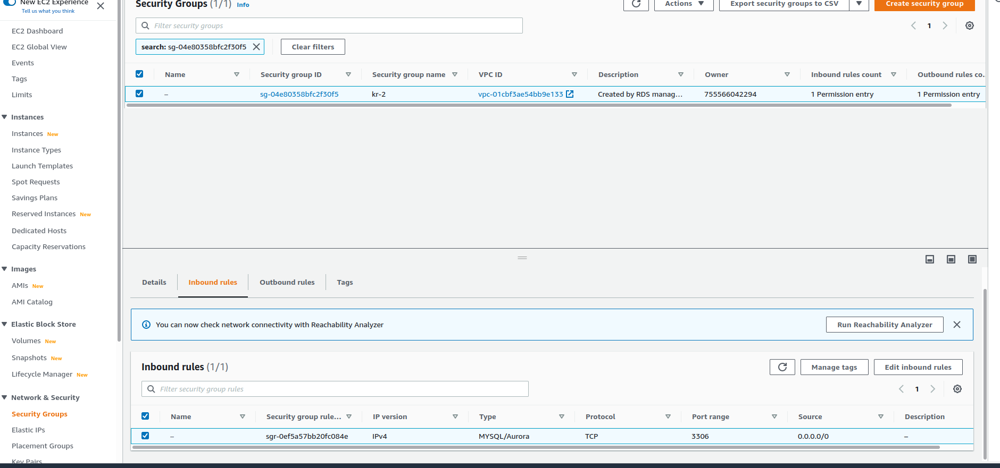
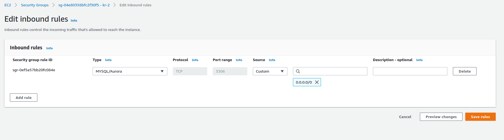

# Example deployment of the Business-API-Ecosystem Marketplace

In order to support the experiments of [i4trust](https://i4trust.org/experiments/), this namespaces contains all components for providing the [marketplace](https://github.com/i4Trust/building-blocks#i4trust-marketplace).

## Keyrock

As the central [IDP](https://github.com/i4Trust/building-blocks#identity-management), [Keyrock](https://github.com/ging/fiware-idm) is used. Keyrock uses [MySQL](https://www.mysql.com/) as its storage backend.
To seperate the persistent state from the cluster and ease the operations, an [AWS RDS](https://aws.amazon.com/free/database/?trk=4bfa3aee-a8ec-4199-b4d6-a92630a09e06&sc_channel=ps&sc_campaign=acquisition&sc_medium=ACQ-P|PS-GO|Brand|Desktop|SU|Database|Solution|DACH|EN|Text|EU&s_kwcid=AL!4422!3!548987291221!e!!g!!aws%20relational%20database%20service&ef_id=Cj0KCQjwz7uRBhDRARIsAFqjulnbqPxDphl2farJ2N-iJ6Ytb7IMLOYLcMjUhJzO4wnG3u0r6m9BiA8aAuLdEALw_wcB:G:s&s_kwcid=AL!4422!3!548987291221!e!!g!!aws%20relational%20database%20service) instance is used.
Its setup with the following configurations:
* engine type: MySql 5.7.37
* templates: Free tier
* username: admin, password should be set to something secure and provided in the [sealed-secret](secrets/keyrock-sealed-secret.yaml). 
* public access: true
* vpc security group: create new
* everything else can be left as default

After creating the instance, go to the security group connected with the RDF instnace and edit the inbound rules, to allow traffic from the openshift cluster:

- select security group and edit inbound rule:

- add inbound rule(0.0.0.0/0 would allow requests from everywhere, you should be more restritive in a production environment)
