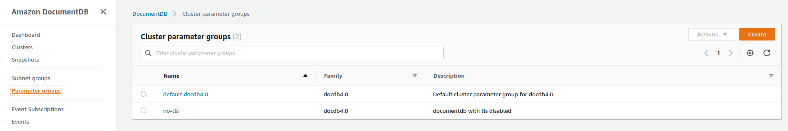

# Example deployment of the Business-API-Ecosystem Marketplace

In order to support the experiments of [i4trust](https://i4trust.org/experiments/), this namespaces contains all components for providing the [marketplace](https://github.com/i4Trust/building-blocks#i4trust-marketplace).

## Keyrock

As the central [IDP](https://github.com/i4Trust/building-blocks#identity-management), [Keyrock](https://github.com/ging/fiware-idm) is used. Keyrock uses [MySQL](https://www.mysql.com/) as its storage backend.
To seperate the persistent state from the cluster and ease the operations, an [AWS RDS](https://aws.amazon.com/free/database/?trk=4bfa3aee-a8ec-4199-b4d6-a92630a09e06&sc_channel=ps&sc_campaign=acquisition&sc_medium=ACQ-P|PS-GO|Brand|Desktop|SU|Database|Solution|DACH|EN|Text|EU&s_kwcid=AL!4422!3!548987291221!e!!g!!aws%20relational%20database%20service&ef_id=Cj0KCQjwz7uRBhDRARIsAFqjulnbqPxDphl2farJ2N-iJ6Ytb7IMLOYLcMjUhJzO4wnG3u0r6m9BiA8aAuLdEALw_wcB:G:s&s_kwcid=AL!4422!3!548987291221!e!!g!!aws%20relational%20database%20service) instance is used.
Its setup with the following configurations:
* engine type: MySql 5.7.37
* templates: Free tier
* username: admin, password should be set to something secure and provided in the [sealed-secret](secrets/keyrock-sealed-secret.yaml). 
* public access: true
* vpc security group: create new
* everything else can be left as default

After creating the instance, go to the security group connected with the RDF instnace and edit the inbound rules, to allow traffic from the openshift cluster:

- select security group and edit inbound rule:

- add inbound rule(0.0.0.0/0 would allow requests from everywhere, you should be more restrictive in a production environment)


## BAE

Similar to the mysql in keyrock, we do use [AWS DocumentDB](https://aws.amazon.com/documentdb/) for providing the [mongoDB](https://www.mongodb.com) compatible storage backend.

To create one, follow the described steps:

1. Create a parameter group to allow non-tls connections(not fully supported by the components yet)

   1. Create a group
   2. Open the group an select the tls configuration:
      
   3. Edit the "tls"-entry and set it to "disabled"
2. Create a security group:

   * choose a name and put it into the VPC of your Openshift Cluster(:warning: DocumentDB only allows connections from within the same VPC)
   * create an inbound rule that allows traffic from the openshift-clusters ip-range, all at least port 27017
3. Create a DocumentDB cluster with the following config:

   * engine version: 4.0.0
   * master-username: mongoadmin, master-password: <your-secure-password>
   * in advanced settings:
     * select the VPC that the openshift cluster is using(DocumentDB only allows connections from within the same VPC)
     * select the security group you created in the previous step
     * wait until its available
The correct configuration can be checked by connecting with a mongo-cli from inside the cluster:
```shell
   kubectl run -it --rm --image=mongo --restart=Never mongo-client -- bash
   $root@mongo-client:/# mongo --host <CLUSTER_URL>:27017 --username mongoadmin --password <YOUR_PASSWORD>
```