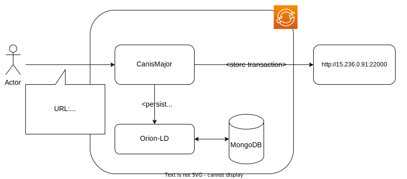

# Test deployment for Token-Project

In order to support the use-case in the [Cattelchain-Project](https://cattlechain.eu/) this namespace provides components for persisting transactions on [NGSI-LD entities](https://docbox.etsi.org/isg/cim/open/Latest%20release%20NGSI-LD%20API%20for%20public%20comment.pdf)
in a block-chain([alastria](https://alastria.io/en/)). 

> :warning: While this installation aims to be close to production environments, it makes a couple of compromises that should be avoided in real enviornments:
> - the API's are unsecured
> - it uses the [defaultAccount-Feature of canis-major](https://github.com/FIWARE/CanisMajor/blob/master/src/main/java/org/fiware/canismajor/configuration/DefaultAccountProperties.java#L10-L14), see [Signature-delegation ADR](https://github.com/FIWARE/CanisMajor/blob/master/docs/adrs/delegate-signatur.md) for the alternative
> - the installation is very small, thus might not be sufficient for production load


Overview:


## Components

- [Orion-LD ContextBroker](https://github.com/FIWARE/context.Orion-LD) for persisting transaction receipts in [NGSI-LD](https://docbox.etsi.org/isg/cim/open/Latest%20release%20NGSI-LD%20API%20for%20public%20comment.pdf)
- [MongoDB](https://www.mongodb.com) as a storage backend for Orion-LD
- [Canis-Major](https://github.com/FIWARE/CanisMajor) as the central api for handling the transactions

## Example usage

1. Create an entity: 
```shell
curl --location --request POST 'https://digitanimal-canis-major-digitanimal.apps.fiware-dev-aws.fiware.dev/ngsi-ld/v1/entities' \
--header 'Content-Type: application/ld+json' \
--header 'Accept: application/json' \
--data-raw '{
    "id": "urn:ngsi-ld:Cow:cow-1",
    "type": "Cow",
    "name": {
    	"type": "Property",
        "value": "Herta"
    },
    "state": {
    	"type": "Property",
        "value": "AT_REST"
    },
    "@context": [
        "https://fiware.github.io/data-models/context.jsonld"
    ]
}'
```

2. Update the entity:
```shell
curl --location --request POST 'https://digitanimal-canis-major-digitanimal.apps.fiware-dev-aws.fiware.dev/ngsi-ld/v1/entities/urn:ngsi-ld:Cow:cow-1/attrs' \
--header 'Content-Type: application/ld+json' \
--header 'Accept: application/json' \
--data-raw '{
    "state": {
    	"type": "Property",
        "value": "GRAZING"
    },
    "@context": [
        "https://fiware.github.io/data-models/context.jsonld"
    ]
}'
```
4. Get the transaction history:
   * For all entities: ```curl -X GET https://digitanimal-canis-major-digitanimal.apps.fiware-dev-aws.fiware.dev/entity```
   * For cow-1: ```curl -X GET https://digitanimal-canis-major-digitanimal.apps.fiware-dev-aws.fiware.dev/entity/urn:ngsi-ld:Cow:cow-1```
 
