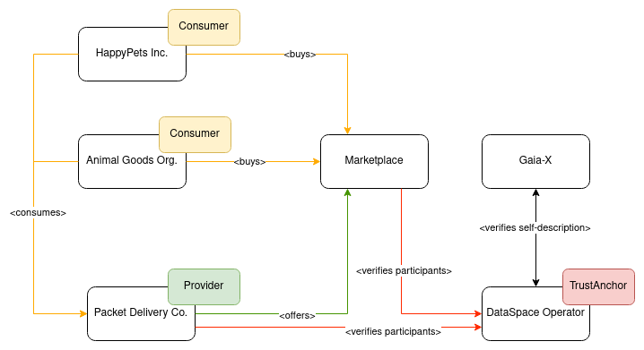

# Demo-Setup DSBA-compliant Dataspace

This folder and its corresponding namespace contain a [DSBA-compliant](https://data-spaces-business-alliance.eu/wp-content/uploads/dlm_uploads/Data-Spaces-Business-Alliance-Technical-Convergence-V2.pdf) DataSpace for demonstrational purposes. The DataSpace is build with [FIWARE-Components](https://github.com/FIWARE), using parts of the [i4Trust-Framework](https://github.com/i4Trust) and the [Gaia-X Compliance Services](https://gitlab.com/gaia-x/lab/compliance).

## The DataSpace

The DataSpace contains 5 particpants in various roles:

- the Marketplace, connecting consumers and providers of Data-Services
- Packet Delivery Co. as a Provider, offering Dataservices around their "traditional" delivery services
- HappyPets Inc. and Animal Goods Org. as Consumers, selling pet-related goods to end-customers using the serivces of Packet Delivery Co.
- the DataSpace Operator as a Trust Anchor, providing validation of participants and functionality to onboard to the dataspace

As an additional actor, outside of the Dataspace, the [Gaia-X Compliance Services](https://gitlab.com/gaia-x/lab/compliance) are used by the Dataspace Operator to validate Self-Descriptions of potential new participants during the OnBoarding.

## The OnBoarding

To allow self-registration of new participants, the [OnBoarding-Portal](https://onboarding-portal.dsba.fiware.dev) is provided.