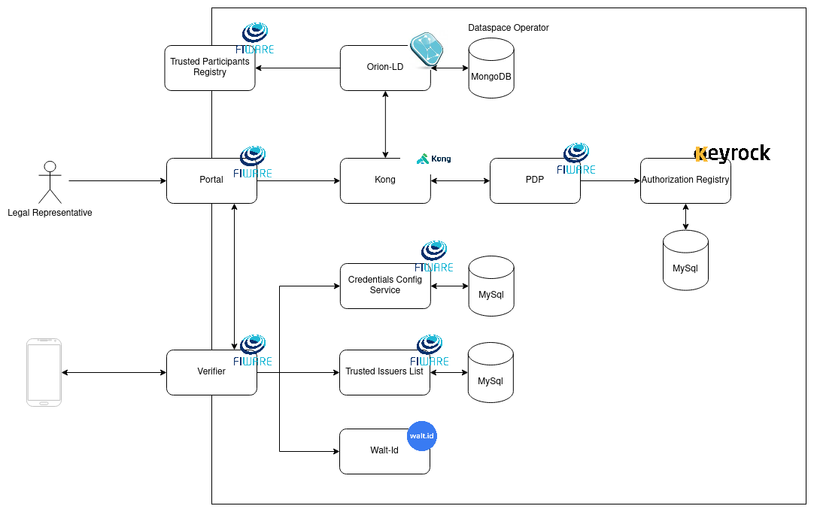
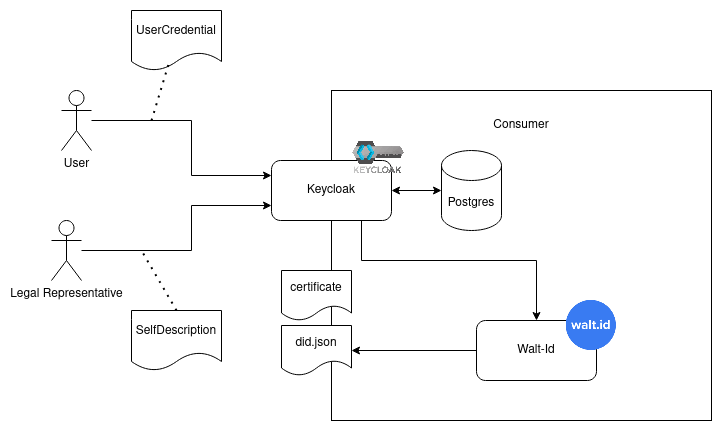
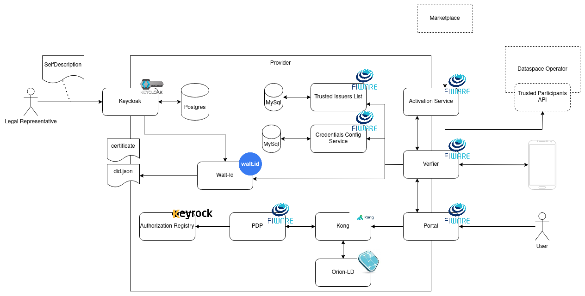
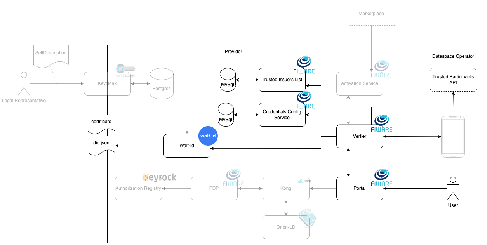
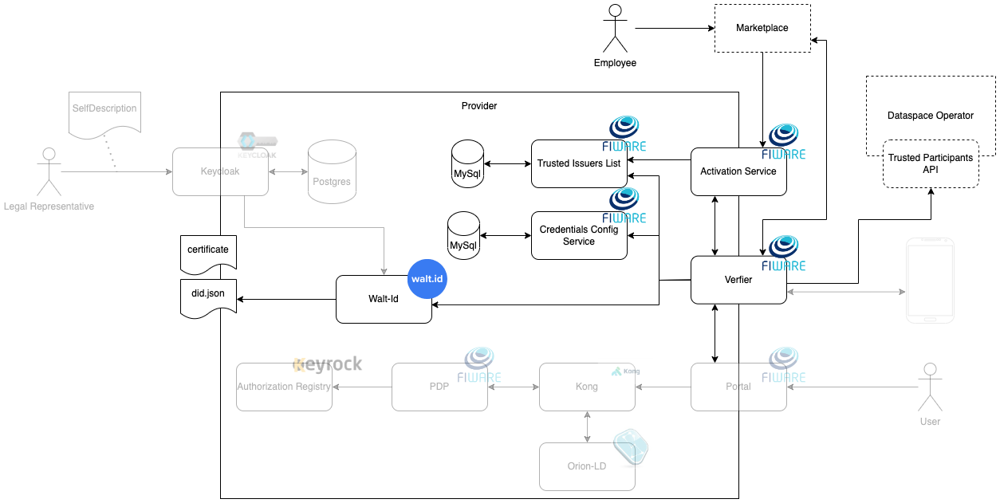
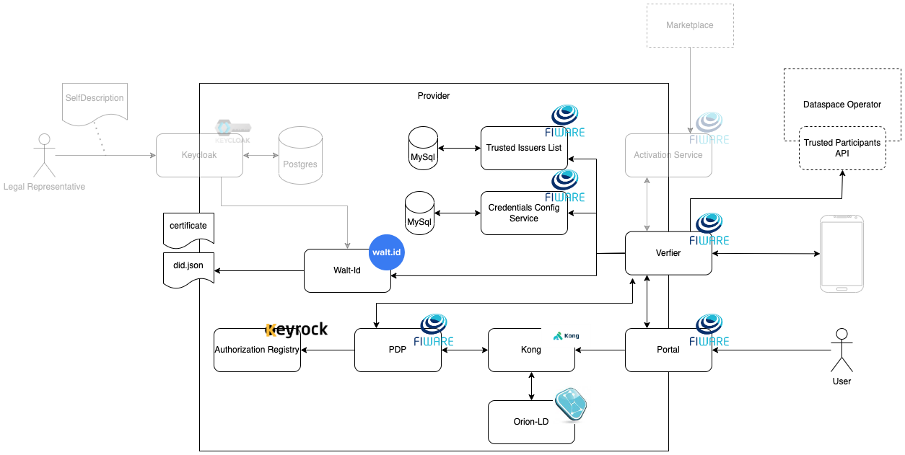

# Demo-Setup DSBA-compliant Dataspace

This folder and its corresponding namespace contain a [DSBA-compliant](https://data-spaces-business-alliance.eu/wp-content/uploads/dlm_uploads/Data-Spaces-Business-Alliance-Technical-Convergence-V2.pdf) DataSpace for demonstrational purposes. The DataSpace is build with [FIWARE-Components](https://github.com/FIWARE), using parts of the [i4Trust-Framework](https://github.com/i4Trust) and the [Gaia-X Compliance Services](https://gitlab.com/gaia-x/lab/compliance).

<!-- ToC created with: https://github.com/thlorenz/doctoc -->
<!-- Update with: doctoc README.md -->

<details>
<summary><strong>Table of Contents</strong></summary>

<!-- START doctoc generated TOC please keep comment here to allow auto update -->
<!-- DON'T EDIT THIS SECTION, INSTEAD RE-RUN doctoc TO UPDATE -->

- [The DataSpace](#the-dataspace)
- [The Dataspace Operator](#the-dataspace-operator)
- [The Particpants](#the-particpants)
  - [The Consumer](#the-consumer)
  - [The Provider](#the-provider)
  - [The Marketplace](#the-marketplace)
- [Flows](#flows)
  - [Onboarding](#onboarding)
  - [Login](#login)
  - [Acquisition](#acquisition)
  - [Service Usage](#service-usage)
- [Credentials](#credentials)
- [URLs and endpoints](#urls-and-endpoints)
- [Presentations](#presentations)
  - [Onboarding of animal Goods](#onboarding-of-animal-goods)
    - [Prepare Credentials in Wallet](#prepare-credentials-in-wallet)
    - [Onboarding in dataspace](#onboarding-in-dataspace)
  - [Create an offering for the Packet Delivery Service](#create-an-offering-for-the-packet-delivery-service)
    - [PDC employee gets VC](#pdc-employee-gets-vc)
    - [Login at marketplace](#login-at-marketplace)
    - [Catalog](#catalog)
    - [Product Specification](#product-specification)
    - [Product Offering](#product-offering)
  - [Offering acquisition by consumer](#offering-acquisition-by-consumer)
    - [Consumer employee gets VC](#consumer-employee-gets-vc)
    - [Login at marketplace](#login-at-marketplace-1)
    - [Acquire access](#acquire-access)
  - [Accessing the service](#accessing-the-service)
    - [Shop customer gets VC](#shop-customer-gets-vc)
    - [Service usage](#service-usage)
  - [Testing](#testing)
  - [Cleanup](#cleanup)

<!-- END doctoc generated TOC please keep comment here to allow auto update -->


</details>


## The DataSpace


The DataSpace contains 5 particpants in various roles:

- the Marketplace, connecting consumers and providers of Data-Services
- Packet Delivery Co. as a Provider, offering Dataservices around their "traditional" delivery services
- HappyPets Inc. and Animal Goods Org. as Consumers, selling pet-related goods to end-customers using the serivces of Packet Delivery Co.
- the DataSpace Operator as a Trust Anchor, providing validation of participants and functionality to onboard to the dataspace

As an additional actor, outside of the Dataspace, the [Gaia-X Compliance Services](https://gitlab.com/gaia-x/lab/compliance) are used by the Dataspace Operator to validate Self-Descriptions of potential new participants during the OnBoarding.


## The Dataspace Operator

The Dataspace Operator acts as the TrustAnchor of the Dataspace. It provides the particpants information on whom to trust. 

To allow self-registration of new participants, the [OnBoarding-Portal](https://onboarding-portal.dsba.fiware.dev) is provided. "OnBoarding" means, that a participant is listed as a trusted participant at the Dataspace's [Trusted Issuers Registry](https://api-pilot.ebsi.eu/docs/apis/trusted-issuers-registry/latest#/). In case of the OnBoarding-Portal, the registry is backed by an [NGSI-LD](https://www.etsi.org/deliver/etsi_gs/CIM/001_099/009/01.06.01_60/gs_cim009v010601p.pdf) ContextBroker, which stores the required information about the participants. The ContextBroker API to store information about the participants is secured with a full DSBA-compliant security framework, therefor a number of components are deployed for the Dataspace Operator:




The components are:

- the Portal as a central GUI, where Legal Representatives of potential participants can log-in and register for the Dataspace
- the Verifier to provide the authentication capabilities to the portal, so that the Legal Representative can use its mobile wallet to authenticate itself
- the Credentials Config Service to provide the Verifier with information about the scope to be requested from the wallet and the trust-anchors(e.g. Trusted Issuers List and Trusted Particpants List) to be used for the credential types
- the Trusted Issuers List that will be used by the Verifier to check that the Issuer is allowed to issue certain credentials and claims
- Walt-Id to verify variuous parts of the credential(f.e. the signature)
- Kong to enforce authorization on the requests towards Orion-LD
- the PDP to decide on the requests towards Orion-LD
- the Authorization Registry to provide the policies, used by the PDP
- Orion-LD to actually store information about the participants
- the Trusted Participants Registry to provide information about the Trusted Participants through an [EBSI-complinat Trusted-Issuers-Registry API](https://api-pilot.ebsi.eu/docs/apis/trusted-issuers-registry/latest#/)

## The Particpants

In the Dataspace, there are two types of participants "Consumers" and "Providers". While a particpant certainly can act in both roles, the demo-environment uses pure "Consumers" and "Providers" for simplicity reasons.

### The Consumer

A "Consumer" is an organization that aquires access to the Dataservices of a "Provider", in our Dataspace through the Marketplace. 
Since the "Provider" in our Dataspace uses a DSAB-compliant Auth-Framework, the "Consumer" can issue [VerifiableCredentials](https://www.w3.org/TR/vc-data-model/) to its users or employess, so that they can access the "Providers" services. 



The consumer has the following components:

- Keycloak as the IDM system, providing the capabilities to issue VerifiableCredential to users and also [Gaia-X Self-Descriptions](https://gaia-x.gitlab.io/technical-committee/architecture-document//operating_model/#self-descriptions-and-attestation) to its Legal-Representatives. 
- Walt-Id to create and sign the actual Credentials and offer the did.json, corresponding to the participants identity


### The Provider

"Provider" offer various kinds of Dataservices throught the Marketplace and make them accessible through the IAM-Framework. In our Dataspace, the "Provider" Packet Delivery Co. provides a Portal, where users can follow the delivery of there orders and, depending on the level of service, change delivery details like the planned time of arrival. Information about the delivery is stored in the Orion-LD ContextBroker, thus can be secured by a DSBA-compliant IAM-Framework. 
Since the IAM-Framework is the same as the "Dataspace Operator" uses for the OnBoarding, the architecture looks quite similar:



The components:

- Keycloak to provide credentials for employees, in the same way as for the [consumer](#the-consumer), to allow self-registration by the provider
- Walt-Id to create and sign credentials and offer the did.json, as the [consumer](#the-consumer) does, and also verify variuous parts of the credential(f.e. the signature) like the [dataspace operator](#the-dataspace-operator)
- the Activation Service, providing an interface to the Marketplace to get new "Consumers" registered in the Trusted Issuers List
- the Portal as GUI for the Users to log-in and see/update their deliveries
- the Verifier to provide the authentication capabilites for the portal(allowing users to log-in) and the Activation Service(allowing the Marketplace to access via M2M-flow)
- the Credentials Config Service, providing information about the scope to be requested and its trust-anchors, same as for the [dataspace operator](#the-dataspace-operator)
- the Trusted Issuers List, used by the Verifier to check the capabilities of an issuer and the Activation Service to add new "Consumer" as trusted issuers
- Kong, to enforce authorization on requests towards Orion-LD(same as [dataspace operator](#the-dataspace-operator))
- the PDP to decide on requests towards Orion-LD(same as [dataspace operator](#the-dataspace-operator))
- the Authorization Registry to provide policies (same as [dataspace operator](#the-dataspace-operator))
- Orion-LD to store and provide information about the deliveries

Additionally, the Verifier connects to the Trusted Participants API of the [Dataspace Operator](#the-dataspace-operator) to verify users as participants of the dataspace.


### The Marketplace


## Flows

Description of the different flows.

### Onboarding

* The user initiates the login at the onboarding portal. A QR code is displayed.
* The user scans the QR code with its mobile wallet. The QR code contains a URL of the verifier to initiate the login.
  The wallet sends a `GET` request to this URL and receives the `/authentication_response` endpoint of the verifier.
* The wallet sends a Verifiable Presentation (VP) to the `/authentication_response` endpoint. The VP contains the VC issued to the user, the VC containing the self description of its company and the VC issued by a trusted Compliancy Service for the company self description.
* The verifier checks against the `Gaia-X Compliance Issuers` whether the compliancy credential was issued by a trusted issuer.
* The verifier checks if the credentials are a valid chain.
* The verifier returns a code, which can be used to obtain an access token from the verifier.
* Now the onboarding portal application can obtain a JWT access token from the verifier `/token` endpoint.
* The token is used to access the Orion-LD service and the VC is stored there. From this point onwards, the stored VC/Self Descriptions can be used by the Trusted Issuers Registry to supply the list of trusted participants of the dataspace.


### Login 

Description of the steps during login using a VC at the portal or marketplace. A VC has been issued to the user before, designated for the service to be logged in, and 
containing the roles for this service issued to the user. The general login flow follows the [OIDC4VP](https://openid.net/specs/openid-4-verifiable-presentations-1_0.html)/[SIOP-2](https://openid.net/specs/openid-connect-self-issued-v2-1_0.html) standard.



* The user initiates the login at the portal/marketplace UI.
* The portal generates a session and forwards it together with its client-id to the verifier
* The verifier requests the scope of the service at the Credentials Config Service
* A QR code containing the connection information for the Wallet is displayed.
* The user scans the QR code with its mobile wallet. The QR code contains a URL of the verifier to initiate the login. 
  The wallet sends a `GET` request to this URL and receives the `/authentication_response` endpoint of the verifier.
* The wallet sends a Verifiable Presentation (VP), containing the VC issued to the user, to the `/authentication_response` endpoint. 
* The verifier retrieves the relevant `Trusted Participants Registreis`and `Trusted Issuers Lists` from the Credentials Config Service, based on the client-id and type of credential
* The verifier validates the signature and validity of the credentials
* The verifier checks against the relevant `Trusted Participants API` whether the issuer organisation is a trusted participants of the data space.
* The verifier checks against the relevant`Trusted Issuers List` whether the issuer is allowed to issue the set of claims(f.e. roles) contained in the VC.
* The verifier returns a code, which can be used to obtain an access token from the verifier
* Now the portal/marketplace application can obtain a JWT access token from the verifiers `/token` endpoint and use the corresponding service.


### Acquisition

Description of the steps during acquisition of a service offering on the marketplace. An employee of a consumer organisation is already logged in 
at the marketplace following 
the [Login](#Login) process described above, and wishes to purchase access to the packet delivery service. During the acquisition process, the marketplace will create 
an entry at the Trusted-Issuers-List (TIL) of PDC, stating that the buying organisation is allowed to issue credentials of type `PacketDeliveryService` 
with the roles stated in the service offering. 

In order to protect access to the TIL of PDC, the activation service (AS) will validate whether the marketplace is allowed to create issuers. 
This requires an entry at the TIL of PDC, stating that the marketplace can issue credentials of type `ActivationService` with the role `CREATE_ISSUER`. 

For authentication, the marketplace will use a VC of type `ActivationService` that with issued before with a very long expiration period.



* The employee performs the checkout on the marketplace.
* The marketplace sends the `POST` request to create an issuer to the `issuer` endpoint of the AS, which contains no `Authorization` header since the marketplace 
  did not obtain an access token yet.
* Since the header is empty, the AS will return a redirect to the `/samedevice` endpoint of the verifier in order to initiate the samedevice-flow.
* The marketplace calls this `/samedevice` and receives the `/authentication_response` endpoint of the verifier.
* The marketplace sends a Verifiable Presentation (VP), containing the VC issued to the marketplace, to the `/authentication_response` endpoint. 
* The verifier checks against the `Trusted Participants API` whether the issuer organisation (marketplace) is a trusted participants of the data space.
* The verifier checks against the `Trusted Issuers List` whether the issuer is allowed to issue VCs of type `ActivationService` and the set of roles contained in the VC.
* The verifier returns a code, which can be used to obtain an access token from the verifier.
* Using that code, the marketplace obtains an access token JWT from the `token` endpoint of the verifier.
* The marketplace repeats sending the request to the `issuer` endpoint of the AS in order to create an issuer. This time it adds the JWT access token to 
  the `Authorization` header.
* The AS validates the JWT with the JWKS of the verifier.
* AS checks in the JWT for the `CREATE_ISSUER` role
* If the validation succeeds, the request is forwarded to the actual `/issuer` endpoint of the TIL and the issuer is entry is created.


### Service Usage

Description of the steps when a shop customer access the service of packet delivery. The customer is already logged in at the PDC portal following 
the [Login](#Login) process described above. The customer wants to retrieve information about its delivery order (and possibly to update 
certain parameters like the planned time of arrival).

The shop organisation already acquired access to the service following the [Acquisition](#Acquisition) process described above. That means, that 
the shop organisation is allowed to issue credentials of type `PacketDeliveryService` and the role(s) `STANDARD_CUSTOMER` (and `GOLD_CUSTOMER`).



* Using the portal, the customer issues an NGSI-LD `GET` (or `PATCH`) request to retrieve information about its delivery order. The JWT access token obtained 
  during the [Login](#Login) process is added to the `Authorization` header.
* The portal sends the request to the PDC Kong endpoint for the packet delivery service. 
* The Kong `pep-plugin` plugin forwards the request to the PDP.
* The PDP validates the JWT with the JWKS of the verifier.
* The PDP requests the policy-role-mappings at the PDC Authorization Registry for the roles contained in the JWT access token.
* The PDP evaluates the NGSI-LD request and compares it to the obtained policies. 
* If the policies allow the requested operation, the request is forwarded to the Context Broker, and the response is returned to the portal.


## Credentials

Different accounts are created automatically with default passwords.

| Component                 | Username             | Password             | Comment                                            |
|---------------------------|----------------------|----------------------|----------------------------------------------------|
| Keycloak Animal Goods Org | legal-representative | legal-representative | Legal representative of the Animal Goods Org. Has seller/customer access to the marketplace. |
| Keycloak Animal Goods Org | standard-employee    | standard-employee    | User that can read info from the onboarding portal |
| Keycloak Animal Goods Org | standard-user        | standard-user        | User that has READ access at the packet delivery service   |
| Keycloak Animal Goods Org | prime-user           | prime-user           | User that has READ/WRITE access at the packet delivery service   |
|                           |                      |                      |                                                    |
| Keycloak HappyPets        | legal-representative | legal-representative | Legal representative of Happy Pets. Has seller/customer access to the marketplace. |
| Keycloak HappyPets        | standard-employee    | standard-employee    | User that can read info from the onboarding portal |
| Keycloak HappyPets        | standard-user        | standard-user        | User that has READ access at the packet delivery service   |
| Keycloak HappyPets        | prime-user           | prime-user           | User that has READ/WRITE access at the packet delivery service   |
|                           |                      |                      |                                                    |
| Keycloak PDC              | the-lear             | the-lear             | Legal representative of PDC that can also read info from the onboarding portal |
| Keycloak PDC              | legal-representative | legal-representative | Legal representative of PDC. Has seller/customer access to the marketplace. |
| Keycloak PDC              | standard-employee    | standard-employee    | User that can read info from the onboarding portal |
|                           |                      |                      |                                                    |
|                           |                      |                      |                                                    |

## URLs and endpoints

The following table lists the URLs of publicly available resources that can be owned in the browser.

| Component                 | URL                            |
|---------------------------|--------------------------------|
| Keycloak PDC              | https://packetdelivery-kc.dsba.fiware.dev |
| AS PDC                    | https://as-packetdelivery.dsba.fiware.dev |
| Kong PDC                  | https://kong-pdc.dsba.fiware.dev |
| Portal PDC                | https://packetdelivery-portal.dsba.fiware.dev |
| Onboarding service        | https://onboarding-portal.dsba.fiware.dev |
| Keycloak Animal Goods Org | https://animalgoods-kc.dsba.fiware.dev |
|                           |                                |
| Keycloak Happy Pets       | https://happypets-kc.dsba.fiware.dev |
|                           |                                |
| Wallet application        | https://demo-wallet.fiware.dev         |
|                           |                                |
| Gaia-X compliance service | https://compliance.dsba.fiware.dev     |
|                           |                                |
| Marketplace               | https://marketplace.dsba.fiware.dev |
| Keycloak Marketplace      | https://marketplace-kc.dsba.fiware.dev |
| Keyrock Marketplace       | https://idp-marketplace.dsba.fiware.dev |
|                           |                                |


## Presentations

This gives a short description of the steps to be performed for presentations.


### Onboarding of animal Goods

An legal representative of the Animal Goods Org wants to onboard its organisation to the dataspace.

#### Prepare Credentials in Wallet

The LEAR (`legal-representative`) has to log in the [Animal Goods Keycloak](https://animalgoods-kc.dsba.fiware.dev/realms/fiware-server/account) to receive two credentials and import them into its [Wallet](https://demo-wallet.fiware.dev). The issuance process follows the [OIDC4VCI standard](https://openid.net/specs/openid-4-verifiable-credential-issuance-1_0.html).

First the VC with the company's self description via the `GaiaXParticipentCredential ldp_vc` type. For this VC the wallet shall also request a Compliancy Credential from `FIWARE compliancy service`. The compliancy credential is used to prove the contents of the SelfDescription. In our `Gaia-X` based on-boarding example, the Gaia-X compliancy service will validate the contents of the self-description and assert them through the Compliancy Credential.

Second the VC for the LEAR via the `NaturalPersonCredential ldp_vc`.

Afterwards the Wallet should contain three VCs.

#### Onboarding in dataspace

The LEAR uses its Wallet to log into the [Onboarding service](https://onboarding-portal.dsba.fiware.dev).After a successful login, the LEAR can add its company, as presented on the left, to the dataspace by pressing the `+` under the company details. For a detailed view on the login flow see chapter [Login](#Login).


### Create an offering for the Packet Delivery Service

An employee of Packet Delivery Company needs to create an offering for the packet delivery service on the marketplace.

#### PDC employee gets VC
Login as `standard-employee` at the [PDC Keycloak](https://packetdelivery-kc.dsba.fiware.dev/realms/fiware-server/account). Issue a VC for `MarketplaceUserCredential Idp_vc` and store it in your wallet. 

#### Login at marketplace
Login at the [Marketplace](https://marketplace.dsba.fiware.dev) as PDC employee using this VC. 

Make sure that you switch the `Session` (top-right drop-down) to the PDC DID, in order to act on behalf of the Packet Delivery Company organisation and not as the user itself.

#### Catalog
Create a catalog `Packet Delivery services` and set it to `Launched`.

#### Product Specification
Create a product specification (Basic or Premium) for the packet delivery service. 

For the asset configuration, select `Is a digital product?` and provide the following configuration:

| Parameter | Value | Description |
|-----------|-------|-------------|
| Digital Asset Type | `NGSI-LD Data Service for VC at trusted-issuer list` | This selects the asset plugin |
| Asset URL | `https://kong-pdc.dsba.fiware.dev/pdc/ngsi-ld/v1` | Should point to the Kong endpoint of the PDC service |
| Trusted-Issuer-List /issuer Endpoint | `https://as-packetdelivery.dsba.fiware.dev/issuer` | Should point to the `/issuer` endpoint of the Activation Service |
| API-Key header name (optional) | `AS-API-KEY` | API-Key header name required by the PDC activation service |
| API-KEY (optional) | `eb4675ed-860e-4de1-a9a7-3e2e4356d08d` | API-Key required by the PDC activation service |
| DID of service provider | `did:web:packetdelivery.dsba.fiware.dev:did` | DID of the service provider (here: Packet Delivery) |
| Verifiable Credential Type | `PacketDeliveryService` | Type of the VC that can be issued by consumers after service acquisition |
| List of roles allowed to be issued | `STANDARD_CUSTOMER,GOLD_CUSTOMER` (Premium) / `STANDARD_CUSTOMER` (Basic) | Roles that can be issued (depending on offered service level) |
| Duration in Minutes | 30 | Expiration time for entry at trsuted-issuers-list. For demonstration purposes, a short time period should be chosen. In real-life one would choose a very long period. |

In the `Attachments` tab, one can provide an image for the presented offering. This URLs can be used:
* Basic: `https://raw.githubusercontent.com/FIWARE-Ops/fiware-gitops/master/aws/dsba/docs/Offerings-VCVP_Basic.png`
* Premium: `https://raw.githubusercontent.com/FIWARE-Ops/fiware-gitops/master/aws/dsba/docs/Offerings-VCVP_Premium.png`

Create the product specification and set it to `Launched`.

#### Product Offering
Create a product offering (Basic or Premium) for the packet delivery service. This is what will be shown to potential 
consumers wishing to acquire the service.

Bundle can be skipped.

Select the product specification to be used for this offering. Select the created catalog.

License and SLA can be skipped.

Under price plan, make sure to de-select the checkbox `Is an open offering?` (for open offerings, the plugin code will not be executed!). 
Only create a price plan, if there is a payment provider configured in the marketplace.

Select the default RS model. 

Create the offering and set it to `Launched`.


### Offering acquisition by consumer

An employee of a service consumer organisation (e.g., Happy Pets, Animal Goods) purches and acquires access to the packet delivery 
service (Premium or Basic).

#### Consumer employee gets VC
Login as `legal-representative` at the Keycloak of the consumer organisation:

* [Happy Pets Keycloak](https://happypets-kc.dsba.fiware.dev/realms/fiware-server/account). 
* [Animal Goods Keycloak](https://animalgoods-kc.dsba.fiware.dev/realms/fiware-server/account). 

Issue a VC for `MarketplaceUserCredential Idp_vc` and store it in your wallet. 

#### Login at marketplace
Login at the [Marketplace](https://marketplace.dsba.fiware.dev) as consumer employee using this VC. 

#### Acquire access
Select the packet delivery service offering to be purchased (Premium or Basic) and add it to the cart. 

For the first checkout, one needs to set a billing address.

Perform the checkout. The BAE plugin will create an entry at the PDC trusted-issuer-list for the consumer organisation. 
From now on the consumer organisation can issue VCs with the roles stated in the offering.


### Accessing the service

A user of the service consumer organisation (e.g., Happy Pets, Animal Goods) accesses the service provided 
by the Packet Dleivery Company, after its organisation has acquired access to it.


#### Shop customer gets VC
Login as `standard-user` or `prime-user` (they differ by the roles that are issued) at the Keycloak of the consumer (shop) organisation:

* [Happy Pets Keycloak](https://happypets-kc.dsba.fiware.dev/realms/fiware-server/account). 
* [Animal Goods Keycloak](https://animalgoods-kc.dsba.fiware.dev/realms/fiware-server/account). 

Issue a VC for `PacketDeliveryService Idp_vc` and store it in your wallet. 

#### Service usage
Login at the [PDC Portal](https://packetdelivery-portal.dsba.fiware.dev) as shop customer using this VC. 

Access should be granted to the portal. 

Enter a delivery ID and get the delivery order. Possible IDs:
* Happy Pets: `urn:ngsi-ld:DELIVERYORDER:HAPPYPETS001`, `urn:ngsi-ld:DELIVERYORDER:HAPPYPETS002`
* Animal Goods: `urn:ngsi-ld:DELIVERYORDER:ANIMALGOODS001`, `urn:ngsi-ld:DELIVERYORDER:ANIMALGOODS002`

A NGSI-LD GET request will be sent to Kong and access should be granted. 

Now try to change the `pda` or `pta` attribute.

A NGSI-LD PATCH request will be sent to Kong. Depending on the user (and the assigned roles), access will be granted or denied. 
If the PATCH is successful, another NGSI-LD GET will be sent in order to refresh the delivery order data.


### Testing
To test an new participent without onboarding it via the Trusted Issuers Registry, following command can be adapted and executed on the TIR's NGSI-LD broker:

```shell
curl  -iX POST 'http://localhost:1026/ngsi-ld/v1/entities' \
-H 'Content-Type: application/json' \
-d '{
    "id": "urn:ngsi-ld:TrustedIssuer:did:web:ips.dsba.aws.fiware.io:did",
    "type": "TrustedIssuer",
    "issuer": {
      "type": "Property",
      "value": "did:web:ips.dsba.aws.fiware.io:did"
    },
    "selfDescription": {
      "type": "Property",
      "value": {
        "id": "did:web:ips.dsba.aws.fiware.io:did",
        "type": "gx:LegalParticipant",
        "gx:legalName": "IPS",
        "gx:legalRegistrationNumber": {
          "gx:vatID": "MYVATID"
        },
        "gx:headquarterAddress": {
          "gx:countrySubdivisionCode": "DE-BER"
        },
        "gx:legalAddress": {
          "gx:countrySubdivisionCode": "DE-BER"
        },
        "gx-terms-and-conditions:gaiaxTermsAndConditions": "70c1d713215f95191a11d38fe2341faed27d19e083917bc8732ca4fea4976700"
      }
    }
  }'
```

To test activating the PacketDeliveryService for a new participant, without acquisition at the marketplace, following command can be adapted and executed 
on the PDC TIL:
```shell
curl --location 'https://til-PDC.dsba.fiware.dev/issuer' \
--header 'Content-Type: application/json' \
--data '{
    "did": "did:web:ips.dsba.aws.fiware.io:did",
    "credentials": [
        {
            "validFor": {
                "from": "2024-03-01T02:00:00Z",
                "to": "2028-03-01T02:00:00Z"
            },
            "credentialsType": "PacketDeliveryService",
            "claims": [
                {
                    "name": "roles",
                    "allowedValues": [
                        "STANDARD_CUSTOMER", "GOLD_CUSTOMER"
                    ]
                }
            ]
        }
    ]
}'
```


### Cleanup

Steps to revert the setup in order to be able to perform the use case presentation above when it was already performed before.

* Remove activated service for Happy Pets at the PDC TIL
```shell
curl -i -X DELETE 'https://til-PDC.dsba.fiware.dev/issuer/did:web:happypets.dsba.fiware.dev:did'
```

* Remove activated service for Animal Goods at the PDC TIL
```shell
curl -i -X DELETE 'https://til-PDC.dsba.fiware.dev/issuer/did:web:animalgoods.dsba.fiware.dev:did'
```

* Remove onboarding of Animal Goods
```shell
kubectl port-forward -ndsba service/dsba-onboarding-portal-orion-ld 1026
curl -X DELETE -v --location 'localhost:1026/ngsi-ld/v1/entities/urn:ngsi-ld:TrustedIssuer:did:web:animalgoods.dsba.fiware.dev:did'
```

* On the marketplace, as PDC employee, set the offering (and product specification) to `Obsolete` and create a new offering (and product specification)
