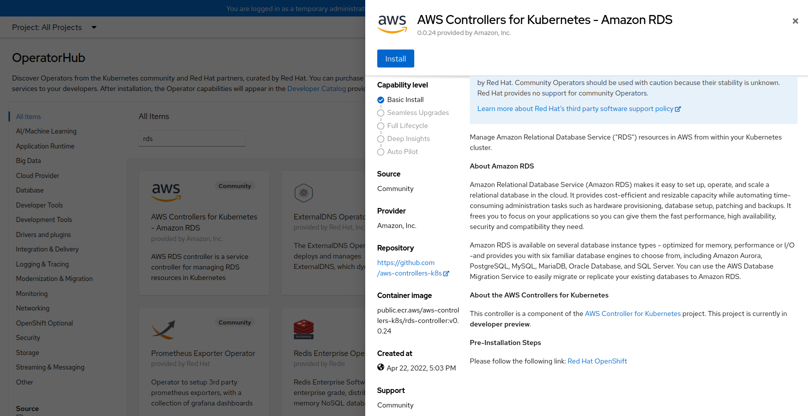
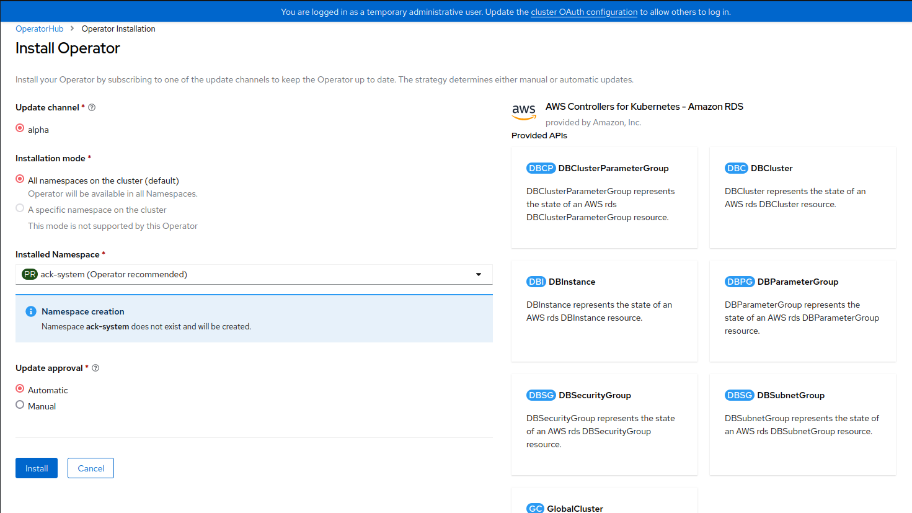

# Databases

In order to allow seperate databases from the actual cluster, we are using managed services provided by AWS. Openshift has a couple of Community Operators for that.
The following chapters describe the steps executed to have automatic support for managed databases in this cluster.

## General pre-requesites

In general, follow the steps described in the [aws-documentation](https://aws-controllers-k8s.github.io/community/docs/user-docs/openshift/):

1. Setup the [```ack-system```-namespace](../aws/namespaces/ack-system.yaml)

2. Create a user:
```shell
    aws iam create-user --user-name ack-service-controller
```

3. Enable programmatic access:
```shell
    aws iam create-access-key --user-name ack-service-controller
```

## Install RDS Controller

The [RDS-Controller](https://github.com/aws-controllers-k8s/rds-controller) is responsible for providing different (SQL)-Databases to the cluster.

1. Add policy to AWS user:
```shell
    aws iam attach-user-policy \
        --user-name ack-service-controller \
        --policy-arn 'arn:aws:iam::aws:policy/AmazonRDSFullAccess'
```

2. Create the user-config(see [aws-doc for more](https://aws-controllers-k8s.github.io/community/docs/user-docs/openshift/)) - [ack-systems/user-config](../aws/ack-system/user-config/)

3. Create the user-secrets, using the access-key created in the previous step(see [aws-doc for more](https://aws-controllers-k8s.github.io/community/docs/user-docs/openshift/)) - [ack-systems/user-config](../aws/ack-system/secrets/) 

4. Select the controller:



5. Install with defaults:



6. Setup Subnet-Group:
The ack-controllers are not (yet) able to manage subnet and security groups, so that we have to prepare them. If this step is skipped, the services won't be allowed to access the created DB-instances.


  1. Get VPC of the OpenShift cluster - replace <CLUSTER-NAME>(f.e. fiware-dev-aws) with the name of your cluster and <CLUSTER-REGION> with your clusters region(f.e. eu-central-1).

  ```shell
    aws ec2 describe-vpcs --filters Name=tag:Name,Values="<CLUSTER_NAME>-*" --query 'Vpcs[*].VpcId' --region <CLUSTER-REGION>
  ```

  2. Get the subnets for this vpc:
  ```shell
    aws ec2 describe-subnets --filters "Name=vpc-id,Values=<VPC_ID>" --query 'Subnets[*].SubnetId' --region <CLUSTER-REGION>
  ``` 

  3. Set subnet-ids and apply the [rds-subnet.yaml](../aws/ack-system/controllers/rds-subnet.yaml) to the cluster.

  4. Create security group:
  ```shell
    aws ec2 create-security-group --group-name rds-sg --description "SG to allow traffic from pod to RDS" --vpc-id <VPC_ID> --region <CLUSTER-REGION>
  ```

  5. Get CIDR range from VPC
  ```shell
    aws ec2 describe-vpcs --vpc-ids <VPC_ID> --query 'Vpcs[].CidrBlock' --output text --region <CLUSTER-REGION>
  ```

  6. Create the inbound rule to allow the traffic:
  ```shell
    aws ec2 authorize-security-group-ingress --group-id <CREATED_SECURITY_GROUP> --port 0-10000 --protocol tcp --cidr "<CIDR_RANGE>" --region <CLUSTER-REGION>
  ```
>:warning: Each DBInstance created has to use the security-group ID as created in step 6.4, else no pod can access it.

7. Insert the security group id and deploy an rds-resource - Example: 
```yaml
apiVersion: rds.services.k8s.aws/v1alpha1
kind: DBInstance
metadata:
  name: mysql
spec:
  allocatedStorage: 20
  dbInstanceClass: db.t3.micro
  dbInstanceIdentifier: "mysql"
  engine: mysql
  engineVersion: 5.7.31
  vpcSecurityGroupIDs: ["<SG_ID"]
  masterUsername: admin
  masterUserPassword:
    namespace: default
    name: password-secret
    key: password
```

## Install Opensearch-Controller(elastic)

1. Add policy to AWS user:
```shell
    aws iam attach-user-policy \
        --user-name ack-service-controller \
        --policy-arn 'arn:aws:iam::aws:policy/AmazonOpenSearchServiceFullAccess'
```

2. Create the user-config(see [aws-doc for more](https://aws-controllers-k8s.github.io/community/docs/user-docs/openshift/)) - [ack-systems/user-config](../aws/ack-system/user-config/)

3. Create the user-secrets, using the access-key created in the previous step(see [aws-doc for more](https://aws-controllers-k8s.github.io/community/docs/user-docs/openshift/)) - [ack-systems/user-config](../aws/ack-system/secrets/) 


2. Select the controller:


3. Install with defaults:


