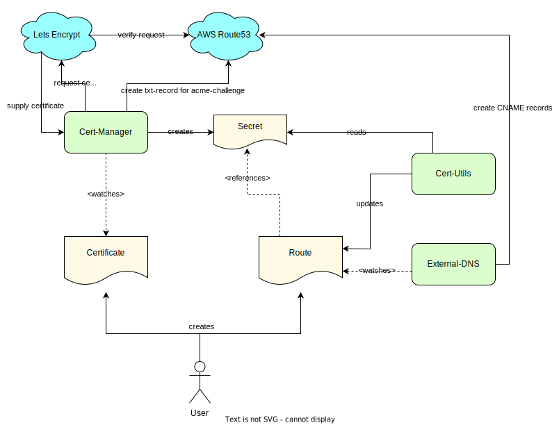
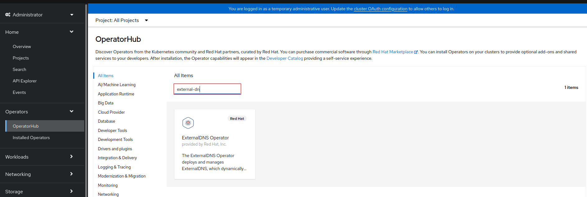
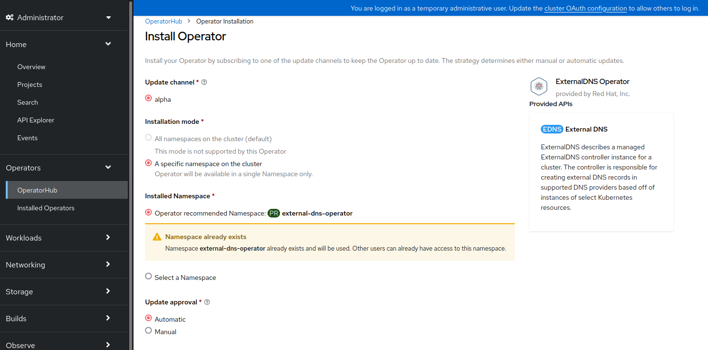
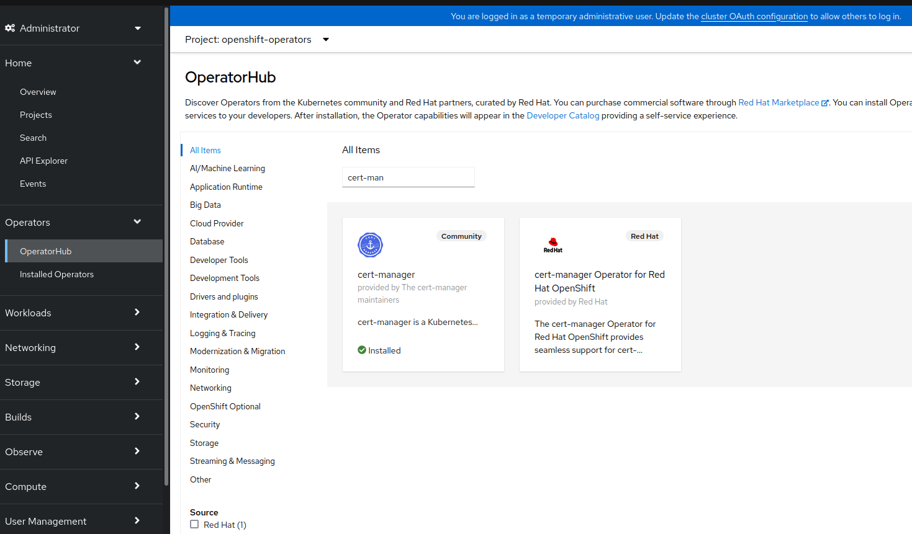
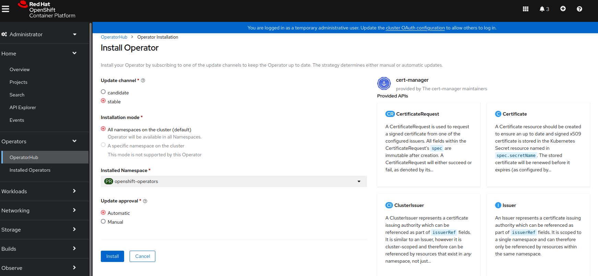
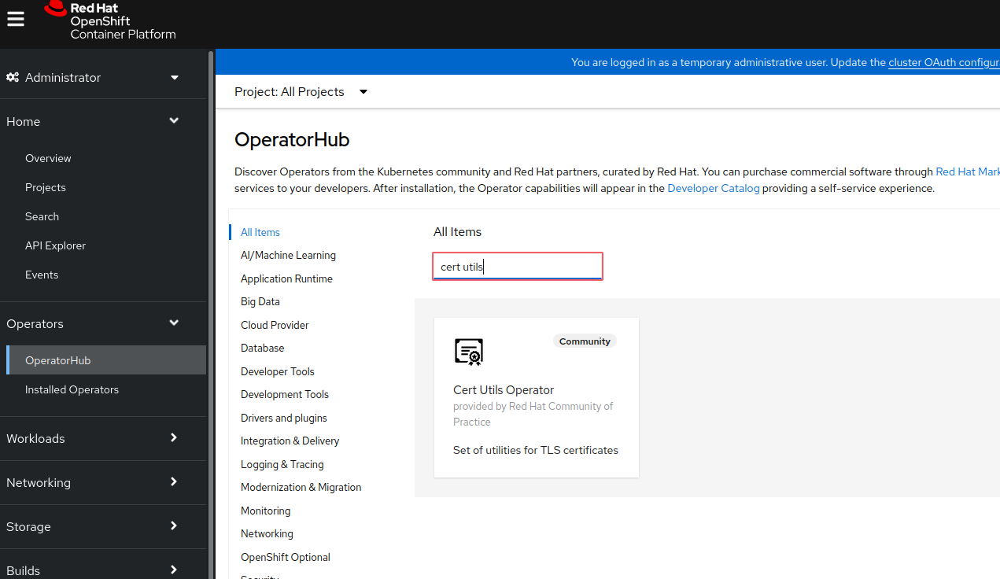
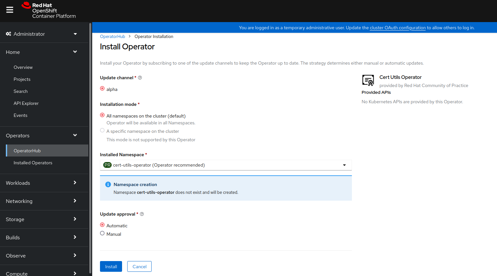

# Routes & Certs

In order to support different hosts and getting them secured automatically, we are using additional operators on our cluster:

* [External-DNS](https://github.com/openshift/external-dns-operator) - allows to automatically create subdomains for hosted-zones
* [Cert-Manager](https://cert-manager.io/v0.15-docs/installation/openshift/) - automatically provide and update ssl-certificates using [Lets encrypt](https://letsencrypt.org/)
* [Cert-Utils](https://github.com/redhat-cop/cert-utils-operator) - automatically inject certificates into openshift' route-objects

## How it works

Due to openshift using its own [route-object](https://docs.openshift.com/container-platform/4.10/rest_api/network_apis/route-route-openshift-io-v1.html), [Cert-Manager](https://cert-manager.io) is not able to directly inject certificates. Therefor we also use [Cert-Utils](https://github.com/redhat-cop/cert-utils-operator) to handle that part.




## External-DNS

The operator is installed via OperatorHub:


1. Search for the operator:


2. Fulfill the documented prerequisites(e.g. create the namespace and roles, according to the documentation)
>:warning: In the current documentation, the operator uses a broken link for installing the extra-roles, use this "https://github.com/openshift/external-dns-operator/blob/main/config/rbac/extra-roles.yaml" instead or replace "main" with the version tag required.

3. Install the operator:


4. Prepare required secrets. For AWS, an access-key with enough permissions to CRUD [route53](https://aws.amazon.com/route53/) is required. If no additional requirements exists, the group "Openshift"(as created in the Openshift installation) can be reused. See [external-dns-operator/secrets/aws-sealed-secret.yaml](../aws/external-dns-operator/secrets/aws-sealed-secret.yaml) for an example.

5. Create an external-dns resource, handling route-objects. See [external-dns/dns-resources/aws-routes-fiware-dev.yaml](../aws/external-dns/dns-resources/aws-routes-fiware-dev.yaml) as an example.

## Cert-Manager

The operator is installed via OperatorHub:

1. Search for the operator:


2. Install: 


3. Install a cluster issuer. For AWS, the example [cert-manager/issuer/lets-encrypt-prod.yaml](../aws/cert-manager/issuer/lets-encrypt-prod.yaml) can be used. For everything else, see the [offical documentation](https://cert-manager.io/v0.12-docs/configuration/).
>:warning: Be aware that cert-manager expects the secret for the issuer in its installation space. If you followed the guide, this will be ```openshift-operators```. See [openshift-operators/secrets/aws-sealed-secret.yaml](../aws/openshift-operators/secrets/aws-sealed-secret.yaml) as an example.

## Cert-Utils

The operator is installed via OperatorHub:

1. Search for the operator:


2. Install: 


## Create a secured route

In order to get a route, with automatic creation of the host and an valid tls-certificate, you need to provide 2 things:


1. The certifcate:
```yaml
apiVersion: cert-manager.io/v1
kind: Certificate
metadata:
  name: fiware-dev-wildcard-cert
spec:
  ## secret the certificate should be stored to, will be referenced by the route
  secretName: fiware-dev-wildcard-tls-secret
  issuerRef: 
    ## certificate issuer, as created in the cert-manager installation step
    kind: ClusterIssuer
    name: letsencrypt-aws-prod
  ## dns configuration. This will be a wildcard certificate, dedicate one can be created, too
  commonName: "*.fiware.dev"
  dnsNames:
    - "*.fiware.dev"
```

2. The route-object:
```yaml
apiVersion: route.openshift.io/v1
kind: Route
metadata:
  annotations:
    ## tells cert-utils to inject certificate information from that secret
    cert-utils-operator.redhat-cop.io/certs-from-secret: fiware-dev-wildcard-tls-secret
  name: fiware-orion-ld
  namespace: fiware
spec:
  ## host to be used for the route, will be created as cname via external-dns  
  host: orion.fiware.dev
  tls:
    ## terminate tls at the loadbalancer, cert-utils will ignore routes without tls config
    termination: edge
  to:
    kind: Service
    name: fiware-orion-ld
```